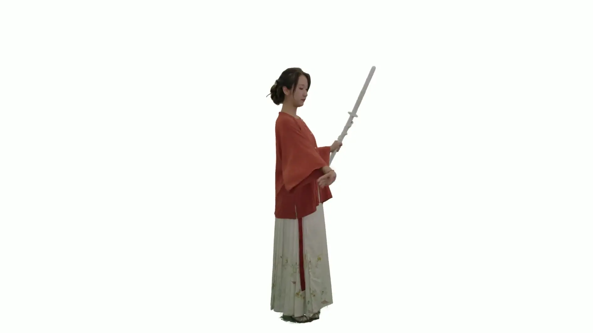
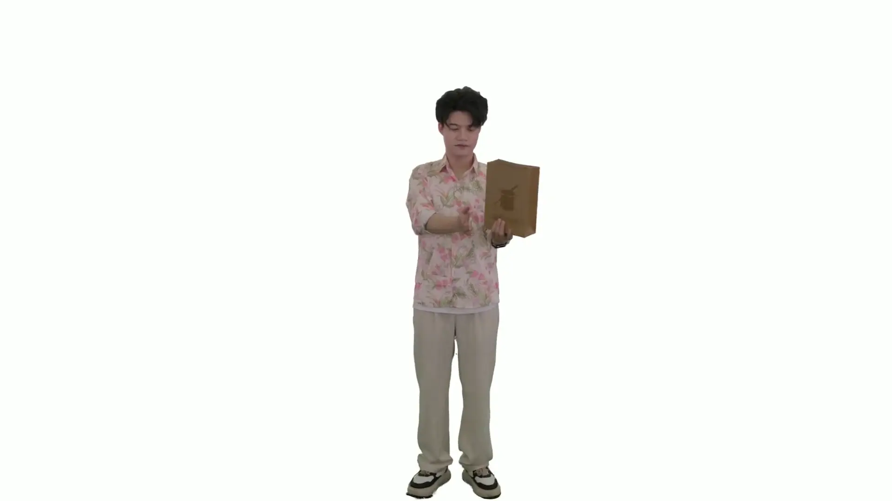

# [SIGGRAPH Asia 2025] Topology-Aware Optimization of Gaussian Primitives for Human-Centric Volumetric Videos
[Yuheng Jiang](https://nowheretrix.github.io/), [Chengcheng Guo](https://Guochch.github.io/), [Yize Wu](https://github.com/wuyize25), [Yu Hong](https://github.com/xyi1023), [Shengkun Zhu](https://github.com/zsk0219), [Zhehao Shen](https://moqiyinlun.github.io/), [Yingliang Zhang](https://cn.linkedin.com/in/yingliangzhang), [Shaohui Jiao](https://cn.linkedin.com/in/shaohui-jiao-3b563826), [Zhuo Su](https://suzhuo.github.io/), [Lan Xu](http://xu-lan.com/), [Marc Habermann](https://people.mpi-inf.mpg.de/~mhaberma/), [Christian Theobalt](https://people.mpi-inf.mpg.de/~theobalt/) 
| [Webpage](https://guochch.github.io/TaoGS/) | [Full Paper](https://arxiv.org/abs/2509.07653) |
[Video](https://www.youtube.com/watch?v=84mgptzNV0A) | [Dataset](https://github.com/HiFi-Human/TaoGS_Dataset) | 
 

## Overview
Official implementation of TaoGS (Topology-Aware Optimization of Gaussian Primitives for Human-Centric Volumetric Videos)

We propose a novel motion-to-appearance Gaussian representation for robust tracking and high-fidelity rendering of general 4D scenes with topological changes. We track sparse motion Gaussians and incorporate new candidate Gaussians through a spatial-temporal tracker and error map to model new observations. The motion Gaussians are then transformed into a Gaussian Look-Up Table (GLUT), activating corresponding appearance Gaussians, which can be packed into 2D attribute maps for efficient video codec compression.

Our work is built upon [3DGS](https://github.com/graphdeco-inria/gaussian-splatting), [DualGS](https://github.com/HiFi-Human/DualGS), and [Reperformer](https://github.com/HiFi-Human/Reperformer).

Show/Hide

  
  
  

Coming soon~
