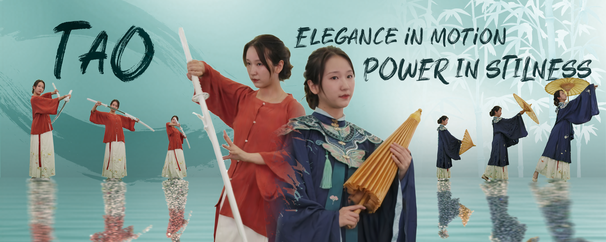
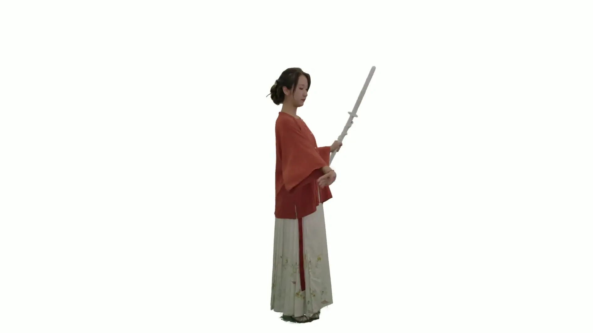
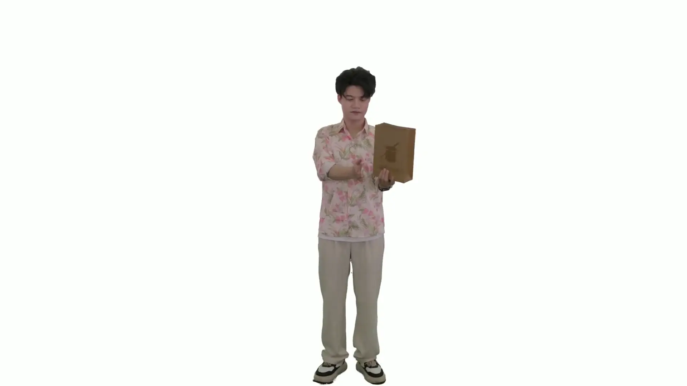

# [SIGGRAPH Asia 2025] Topology-Aware Optimization of Gaussian Primitives for Human-Centric Volumetric Videos

[Yuheng Jiang](https://nowheretrix.github.io/), [Chengcheng Guo](https://Guochch.github.io/), [Yize Wu](https://github.com/wuyize25), [Yu Hong](https://github.com/xyi1023), [Shengkun Zhu](https://github.com/zsk0219), [Zhehao Shen](https://moqiyinlun.github.io/), [Yingliang Zhang](https://cn.linkedin.com/in/yingliangzhang), [Shaohui Jiao](https://cn.linkedin.com/in/shaohui-jiao-3b563826), [Zhuo Su](https://suzhuo.github.io/), [Lan Xu](http://xu-lan.com/), [Marc Habermann](https://people.mpi-inf.mpg.de/~mhaberma/), [Christian Theobalt](https://people.mpi-inf.mpg.de/~theobalt/)

| [Webpage](https://guochch.github.io/TaoGS/) | [Full Paper](https://arxiv.org/abs/2509.07653) | [Video](https://www.youtube.com/watch?v=84mgptzNV0A) | [Dataset](https://github.com/HiFi-Human/TaoGS_Dataset) |



## Overview

Official implementation of TaoGS (Topology-Aware Optimization of Gaussian Primitives for Human-Centric Volumetric Videos)

We propose a novel motion-to-appearance Gaussian representation for robust tracking and high-fidelity rendering of general 4D scenes with topological changes. We track sparse motion Gaussians and incorporate new candidate Gaussians through a spatial-temporal tracker and error map to model new observations. The motion Gaussians are then transformed into a Gaussian Look-Up Table (GLUT), activating corresponding appearance Gaussians, which can be packed into 2D attribute maps for efficient video codec compression.

Our work is built upon [3DGS](https://github.com/graphdeco-inria/gaussian-splatting), [DualGS](https://github.com/HiFi-Human/DualGS), and [RePerformer](https://github.com/HiFi-Human/Reperformer).

This release provides training and rendering; the compression pipeline is not included.

<p align="center">
  
  
  
</p>

## Setup

We tested PyTorch 2.1.2 and 2.7.1 with CUDA 11.8 on Linux, Python 3.10, and
GCC 9.4. PyTorch 2.0+ is supported. Install PyTorch separately with a matching
torchvision version; the following uses 2.7.1 as an example:

```bash
conda create -n taogs python=3.10 pip -y
conda activate taogs
python -m pip install --upgrade pip
python -m pip install torch==2.7.1 torchvision==0.22.1 \
  --index-url https://download.pytorch.org/whl/cu118
python -m pip install -r requirements.txt
export CUDA_HOME=/usr/local/cuda-11.8
export PATH="$CUDA_HOME/bin:$PATH"
bash scripts/install_extensions.sh
```

CUDA Toolkit with `nvcc` is required
to build the extensions.

## Dataset

Download the [TaoGS dataset](https://huggingface.co/datasets/moqiyinlun1/HiFiHuman/tree/main/TaoGS_Dataset)
and follow [TaoGS_Dataset](https://github.com/HiFi-Human/TaoGS_Dataset) to extract
video frames, remove backgrounds, and undistort images. Set the dataset path
and frame range in its `process.sh`.
Use the undistorted output:

```text
sequence/
└── image_undistortion_white/
    ├── colmap/sparse/0/          # COLMAP calibration (binary or text)
    ├── 0/
    │   ├── 0.png                # Numeric camera ID
    │   └── ...
    └── ...
```


### Visibility preprocessing

Download CoTracker3 once:

```bash
git clone https://github.com/facebookresearch/co-tracker.git third_party/co-tracker
git -C third_party/co-tracker checkout 82e02e8029753ad4ef13cf06be7f4fc5facdda4d
mkdir -p third_party/co-tracker/checkpoints
wget -O third_party/co-tracker/checkpoints/scaled_offline.pth \
  https://huggingface.co/facebook/cotracker3/resolve/main/scaled_offline.pth
```

Prepare training images and visibility masks:

```bash
CUDA_VISIBLE_DEVICES=0 python scripts/prepare_processed_sequence.py \
  --source /path/to/sequence/image_undistortion_white \
  --output /path/to/prepared --frame-ed 300 \
  --cotracker-root third_party/co-tracker \
  --checkpoint third_party/co-tracker/checkpoints/scaled_offline.pth
```

This writes `prepared/image_white/<frame>/<camera>.png` at 1920×1080 with
updated calibration, and `prepared/visibility.npz`.

## Training

```bash
CUDA_VISIBLE_DEVICES=0 python train.py \
  -s /path/to/prepared/image_white -m /path/to/new-run \
  --flow_path /path/to/prepared/visibility.npz \
  --frame_st 0 --frame_ed 300 --parallel_load
```

Defaults train motion followed by appearance, using EDGS initialization and
FPS to 20,000 motion points. Candidate filtering follows the paper. Choose a
new output directory for each run.

### Core Parameters

| Parameter | Default | Description |
|-----------|---------|-------------|
| `--stage` | `all` | Both stages, or `motion` / `appearance` only. |
| `--frame_st / --frame_ed` | `0 / 500` | Start inclusive, end exclusive. |
| `--iterations` | `30000` | First-frame iterations per stage. |
| `--motion_rest_iters / --appearance_rest_iters` | `6000 / 10000` | Subsequent-frame iterations. |
| `--edgs_fps_target_points` | `20000` | Motion points after initialization. |
| `--densify_min_opacity` | `0.2` | First-frame opacity pruning threshold; preserves the point target. |
| `--motion_folder` | `<run>/motion/track` | Motion results for appearance-only training. |
| `-r` | `1` | Image downsampling factor. |

`<run>` is the output directory passed to `-m`. If `--motion_folder` is omitted,
it defaults to `<run>/motion/track`; for example, `-m /path/to/new-run` uses
`/path/to/new-run/motion/track`. To reuse motion results from another run for
appearance-only training, set `--stage appearance --motion_folder /path/to/previous-run/motion/track`.

Checkpoints are saved as:

```text
run/
├── motion/track/ckt/point_cloud_<frame>.ply
└── appearance/ckt/point_cloud_<frame>.ply
```

## Rendering

```bash
python render.py -m /path/to/run --stage appearance \
  --frame_st 0 --frame_ed 300 \
  --camera_start 0 --camera_end 1 \
  --output_dir /path/to/new-render-output
```

The example renders camera 0. Camera ranges are end-exclusive; omit them to
render all views. Use `--stage motion` to render motion Gaussians. The dataset,
resolution, and background are loaded from the training configuration.
Outputs are saved under `render/` and `gt/`.

## License

This repository retains the Gaussian Splatting research-only
[license](LICENSE.md). We thank the authors of Gaussian Splatting, DualGS,
EDGS, RoMa, and CoTracker for their work.

Bundled dependencies retain their own licenses: [RoMa](third_party/RoMa/LICENSE)
and [fused-ssim](third_party/fused-ssim/LICENSE) use BSD 3-Clause;
the [rasterizer](third_party/diff-gaussian-rasterization-taming/LICENSE.md)
uses the Gaussian Splatting research-only license. simple-knn retains the Inria
non-commercial research/evaluation notices under the root license. The bundled
GLM headers retain their [license](third_party/diff-gaussian-rasterization-taming/third_party/glm/copying.txt).
The separately downloaded CoTracker source and weights are subject to their
upstream license.

## Acknowledgements

The authors would like to thank Meihan Zheng and Yiwen Cai from ShanghaiTech University for processing the dataset. We also thank the reviewers for their feedback. This work was supported by National Key R&D Program of China (2022YFF0902301), Shanghai Local college capacity building program (22010502800). We also acknowledge support from Shanghai Frontiers Science Center of Human-centered Artificial Intelligence (ShangHAI).

## BibTeX

```bibtex
@misc{jiang2025topology,
  title={Topology-Aware Optimization of Gaussian Primitives for Human-Centric Volumetric Videos},
  author={Yuheng Jiang and Chengcheng Guo and Yize Wu and Yu Hong and Shengkun Zhu and Zhehao Shen and Yingliang Zhang and Shaohui Jiao and Zhuo Su and Lan Xu and Marc Habermann and Christian Theobalt},
  year={2025},
  eprint={2509.07653},
  archivePrefix={arXiv},
  primaryClass={cs.GR},
  url={https://arxiv.org/abs/2509.07653}
}
```

We will continue to refine this implementation to improve reconstruction quality and usability.
